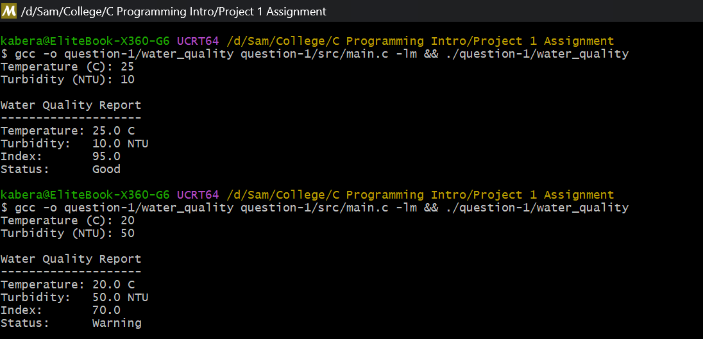

# Question 1: Water Quality Monitoring System

## What the program does

This program is for a water quality device. It asks the user for two sensor readings, the temperature in Celsius and the turbidity in NTU. Then it calculates a water quality index with this formula:

```
Index = 100 - (TemperatureDeviation + TurbidityPenalty)
```

The temperature deviation is `abs(temperature - 25)` and the turbidity penalty is `turbidity / 2`.

After that the program prints a small report with the readings, the index and the status. The status depends on the index:

- Good if the index is 80 or more
- Warning if the index is 60 or more but less than 80
- Critical if the index is less than 60

## Files

- `src/main.c` is the source code
- `screenshots/output.png` is the output from two test runs

## How to compile and run

I used gcc in the terminal:

```bash
gcc -o question-1/water_quality question-1/src/main.c -lm
./question-1/water_quality
```

The `-lm` is needed because the program uses `fabs()` from `math.h`.

## Sample output



In the first run the temperature is 25 and turbidity is 10, so the index is 95 and the water is Good. In the second run the temperature is 20 and turbidity is 50, so the index is 70 and the status is Warning.

## How the code is organized

The program has three functions, not only `main()`:

- `read_number()` reads one number from the user and checks that the input is really a number
- `calculate_index()` does the index formula and gives back the result
- `classify_water()` takes the index and gives back the status ("Good", "Warning" or "Critical")

So part of the calculation and the classification are done in other functions, like the assignment asks.

## Technical explanation

### a. Real-world application

C is used a lot in embedded systems. One real example is the firmware inside a water quality sensor, like the device in this assignment. Small boards like Arduino run C code directly on the microcontroller. C is good for this because it is fast, it does not need much memory, and it can talk directly to the hardware pins and the sensors. There are many other examples too, like washing machines, car engine control and medical devices. They all need a small and fast language, and that is why C is used there.

### b. Error analysis

A syntax error example: if I write `printf("Index: %.1f\n", index` and I forget the closing `)`, or I forget the semicolon, the compiler stops and gives an error. It is a syntax error because the code breaks the grammar rules of C, so the compiler cannot even translate it.

A semantic error example: if I write the formula wrong, for example `index = 100 - temperature - turbidity / 2` instead of using `fabs(temperature - 25)`, the program still compiles and runs without any error message. But the answer is wrong for a temperature below 25. It is a semantic error because the meaning of the code is wrong, not the grammar. The compiler cannot catch this kind of error, only testing finds it.

### c. Compilation lifecycle

My source code starts as text in `main.c` and becomes an executable in four stages:

1. Preprocessing. The input is `main.c`. The preprocessor handles the lines that start with `#`, like `#include <stdio.h>`. It pastes the header contents into the file and removes the macros. The output is an expanded source file.
2. Compilation. The input is the expanded source file. The compiler translates the C code into assembly for the CPU. The output is an assembly file.
3. Assembly. The input is the assembly file. The assembler turns it into machine code. The output is an object file (`main.o`).
4. Linking. The input is the object file plus the library code (like the math library for `fabs`). The linker joins everything and fixes the addresses of the functions. The output is the final executable, `water_quality.exe` on Windows.

After that I can run the program directly.
