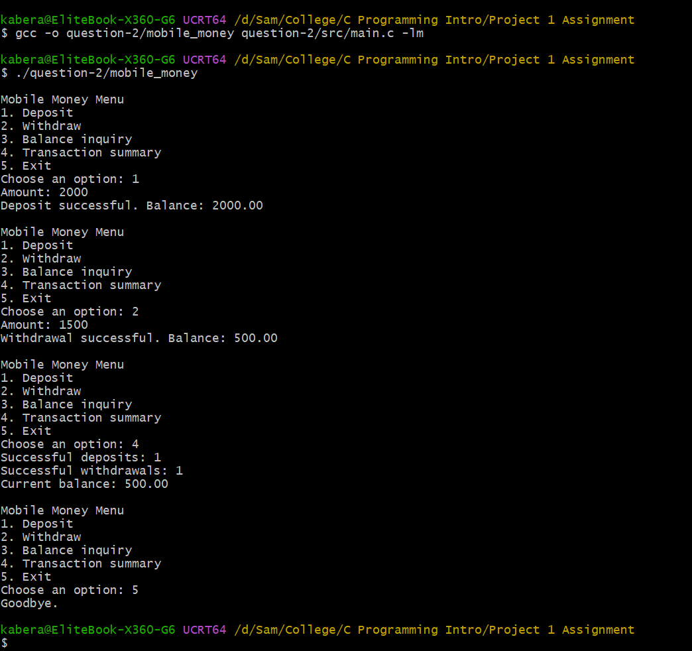
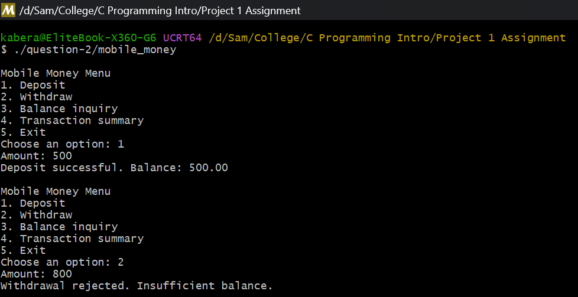
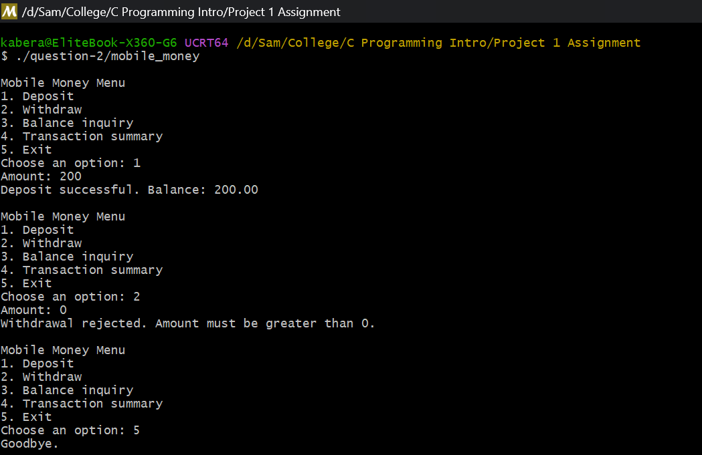

# Question 2: Mobile Money Transaction System

## What the program does

This program is a simple transaction system for a mobile money service. It shows a menu with five options:

1. Deposit, it adds an amount to the balance
2. Withdraw, it takes an amount from the balance, but only if the balance is enough
3. Balance inquiry, it shows the current balance
4. Transaction summary, it shows how many deposits and withdrawals were successful
5. Exit, it ends the program

The user can do many transactions in a row because the menu keeps coming back until the user picks Exit.

## Files

- `src/main.c` is the source code
- `screenshots/successful-transcation.png` shows a deposit, a withdrawal, the summary and the exit
- `screenshots/insufficient-withdrawal.png` shows a withdrawal that gets rejected
- `screenshots/invalid-opttion.png` shows a wrong amount (0) that gets rejected

## How to compile and run

```bash
gcc -o question-2/mobile_money question-2/src/main.c -lm
./question-2/mobile_money
```

## Sample input/output

The assignment asks for at least three different menu operations and one invalid transaction. My screenshots show more than that:



Here I deposit 2000, withdraw 1500, check the summary (1 deposit and 1 withdrawal) and then exit. Everything works fine.



Here I deposit 500 and then I try to withdraw 800. The program rejects it because 800 is more than the balance, and the menu comes back.



Here I try to withdraw 0. The program rejects it because the amount must be greater than 0, then the menu comes back again.

## How the program works

The balance and the amounts are `double` because money can have decimals. The deposit and withdrawal counters are `int`, and the menu choice is also `int`.

The whole menu lives inside a `for (;;)` loop. This is an infinite loop, so the menu shows again and again. The loop only stops when the user chooses option 5, and then a `break` ends it.

After reading the choice, a `switch` jumps to the correct case (1 to 5). Each case handles one operation. Inside the cases I also use `break` to leave the switch after finishing the operation.

When the input is not valid (a bad menu choice, or a negative amount), the program prints a rejection message and uses `continue`. This jumps back to the top of the loop and shows the menu again, without doing any transaction.

The program also protects against invalid transactions:

- A deposit or a withdrawal must be more than 0
- A withdrawal is rejected if the amount is bigger than the balance
- A menu choice must be a number from 1 to 5

Every transaction prints a clear message, so the user always knows what happened.
