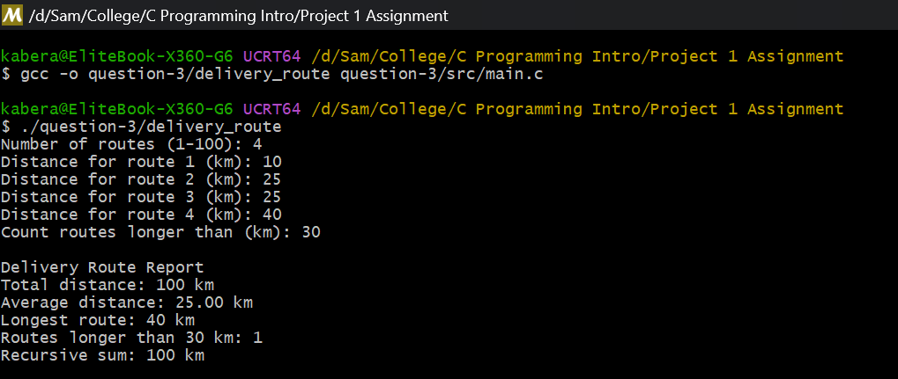
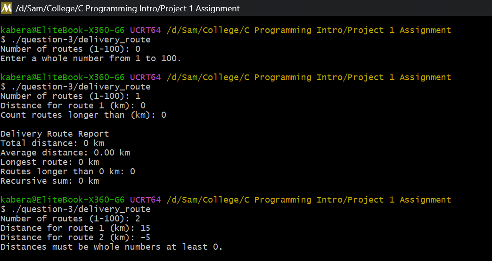

# Question 3: Delivery Route Analysis

## What the program does

This program is for a logistics company that wants to check the distances of its delivery routes. The user types how many routes there are, then types the distance of each route, and then types a limit. The program stores the distances in an integer array and prints a report with:

- The total distance of all routes
- The average distance
- The longest route
- How many routes are longer than the limit
- The sum done again with a recursive function, so we can check it matches the total

## Files

- `src/main.c` is the source code
- `screenshots/sample-output.png` is a normal run of the program
- `screenshots/edge-cases-examples.png` is three test runs with strange input

## How to compile and run

```bash
gcc -o question-3/delivery_route question-3/src/main.c
./question-3/delivery_route
```

## Sample input/output



Here I enter 4 routes: 10, 25, 25 and 40 km, and the limit is 30. The report shows a total of 100 km, average 25.00 km, longest route 40 km, 1 route above 30 km, and the recursive sum is also 100 km. The recursive sum matches the normal total, so both functions work the same way.



I also tested some edge cases:

- If the number of routes is 0, the program prints an error, because it needs at least 1 route
- If there is 1 route with distance 0, everything works and the report shows zeros
- If I type a negative distance like -5, the program rejects it, because a distance cannot be negative

## How the program is divided into functions

Every job has its own small function:

- `read_integer()` reads a whole number from the user and checks the input
- `total_distance()` goes through the array and adds all the distances
- `average_distance()` divides the total by the number of routes
- `longest_distance()` starts with the first distance and keeps the biggest one it finds
- `count_above_limit()` counts how many distances are bigger than the limit
- `recursive_sum()` sums the array with recursion (explained below)
- `main()` reads the input, calls the other functions and prints the report

## Function reuse

The assignment asks to show function reuse. I do it in two ways. First, `average_distance()` does not sum the array by itself, it calls `total_distance()` and just divides the result. So one function is used inside another calculation. Second, all my functions take the array and the count as arguments, so they work with any input I pass to them, not just one fixed array.

## How the recursive function works

`recursive_sum()` calculates the sum of the array by calling itself:

- The base case: if `count` is 0, there is nothing left to add, so the function returns 0. This is what stops the recursion.
- The recursive step: otherwise, it takes the last distance `distances[count - 1]` and adds it to `recursive_sum(distances, count - 1)`. Every call makes the problem smaller because the count goes down by 1 each time, so it always moves toward the base case.
- Returning the result: each call gives back its partial sum to the caller, so the sums add up on the way back and the first call returns the full total.

A small example with `{10, 25}`: the call with count 2 returns `25 + recursive_sum(count=1)`, that one returns `10 + recursive_sum(count=0)`, and the base case returns 0. So the answer is 25 + 10 + 0 = 35.

## Advantage and limitation of recursion

One advantage: the recursive version is short and easy to read. The idea "the sum is the last element plus the sum of the rest" is written almost like the sentence itself.

One limitation: every recursive call uses extra memory on the call stack. For a big array this wastes memory, and if the array was very large the program could even crash with a stack overflow. A simple loop uses just one function call and a fixed amount of memory, so for this problem a loop is safer in practice.
