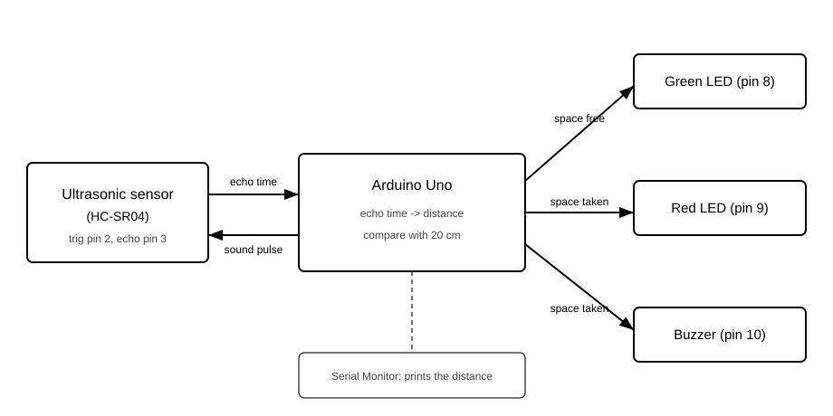
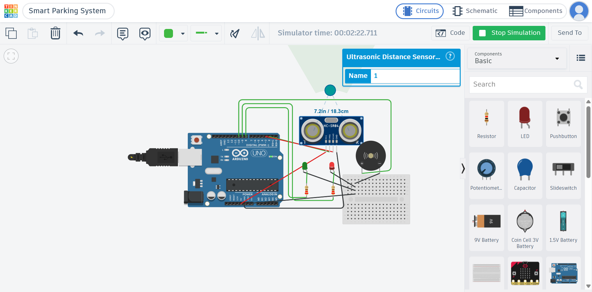

# Question 4: Smart Parking System

## What the project does

This is an Arduino sketch for a smart parking system. An ultrasonic sensor (HC-SR04) measures how far the closest object in front of it is. The program uses that distance to decide if the parking space is free or taken:

- Space is free: the green LED turns on, the red LED is off, and the buzzer is silent
- Space is taken: the red LED turns on, the green LED is off, and the buzzer makes a sound (a 1000 Hz tone)
- No echo: if the sensor does not hear an echo at all, the program treats the space as free and prints a message about it

The space counts as taken when the distance is 20 cm or less. The Serial Monitor also prints the distance every loop, so it is easy to follow what the sensor sees.

## Block diagram

This diagram shows how the data moves through the system, from the sensor to the outputs.

The sensor sends out a sound pulse and waits for the echo. The echo time goes to the Arduino. The Arduino turns the echo time into a distance in cm and compares it with the 20 cm threshold. Then it turns the right outputs on or off, and it also prints the distance on the Serial Monitor.

## Files

- `src/smart_parking.ino` is the code
- `images/block-diagram.svg` is the block diagram
- `images/outside-threshold-test.png` and `images/within-threshold-test.png` are the two simulation test cases

## The circuit

I built the circuit in Tinkercad. The parts are one Arduino Uno, one HC-SR04 ultrasonic sensor, one green LED, one red LED (each with a resistor) and one buzzer.

The circuit is here: [Smart Parking System on Tinkercad](https://www.tinkercad.com/things/5Oco2Zb6GjI-smart-parking-system?sharecode=CSi3YBks-K06hw4f-pm8hd9fFd7pB8FfYjWkqLNevXs)

The wiring:

- The sensor trig pin goes to pin 2, and the echo pin goes to pin 3
- The green LED goes to pin 8, the red LED to pin 9, and the buzzer to pin 10

## Role of each component

- Arduino Uno: it is the brain. It runs the code, does the calculation and controls all the other parts
- HC-SR04 sensor: it measures the distance. It sends out an ultrasonic sound and listens for the echo, and the echo time tells us how far the object is
- Green LED: it means the space is free. The driver sees the green light and knows they can park
- Red LED: it means the space is taken. It gives a warning to the next driver
- Buzzer: it makes a sound when the space is taken, so even if the driver is not looking, they hear it
- Resistors: they protect the LEDs, because an LED connected directly to a pin can burn out

## Simulation test cases

I tested the two main cases in the Tinkercad simulator.

Test case 1, the vehicle is outside the threshold. The sensor shows 24.1 cm, which is bigger than 20 cm, so the space is free. Green LED on, red LED off, buzzer off.

Test case 2, the vehicle is inside the threshold. The sensor shows 18.3 cm, which is less than 20 cm, so the space is taken. Red LED on, green LED off, buzzer on.

## How the code works

The sketch has the two normal Arduino functions.

`setup()` runs one time. It sets the sensor pins, the LEDs and the buzzer as outputs or inputs, and starts the Serial Monitor at 9600 baud.

`loop()` runs again and again forever. Each time it does these steps:

1. It sends a short 10 microsecond pulse on the trig pin, so the sensor sends out an ultrasonic sound
2. It uses `pulseIn()` to wait for the echo and measure how long the sound took to come back
3. If there is no echo, it shows the space as free and prints a message
4. If there is an echo, it converts the time to centimeters with `echoTime * 0.0343 / 2.0`. The 0.0343 is the speed of sound in cm per microsecond, and we divide by 2 because the sound travels to the object and comes back
5. It compares the distance with the 20 cm threshold and switches the LEDs and the buzzer based on the result
6. It waits 200 ms with `delay(200)` so the readings are not too fast

So the sensor data is processed like this: echo time, then distance in cm, then a simple `if` check against the threshold. The Arduino controls the outputs with `digitalWrite()` for the two LEDs and `tone()` / `noTone()` for the buzzer, so the outputs always match the latest distance reading.

The threshold is in a variable called `occupiedThresholdCm`, so it is easy to change if the parking spot has a different size.
